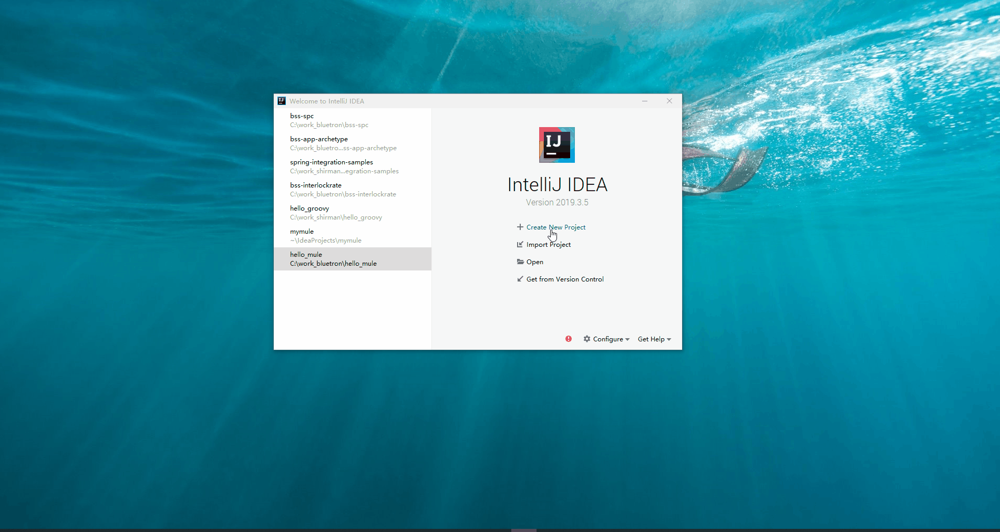
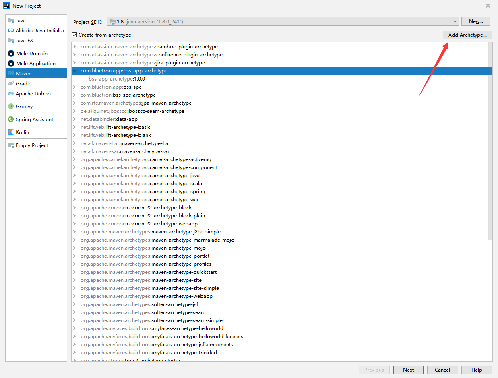
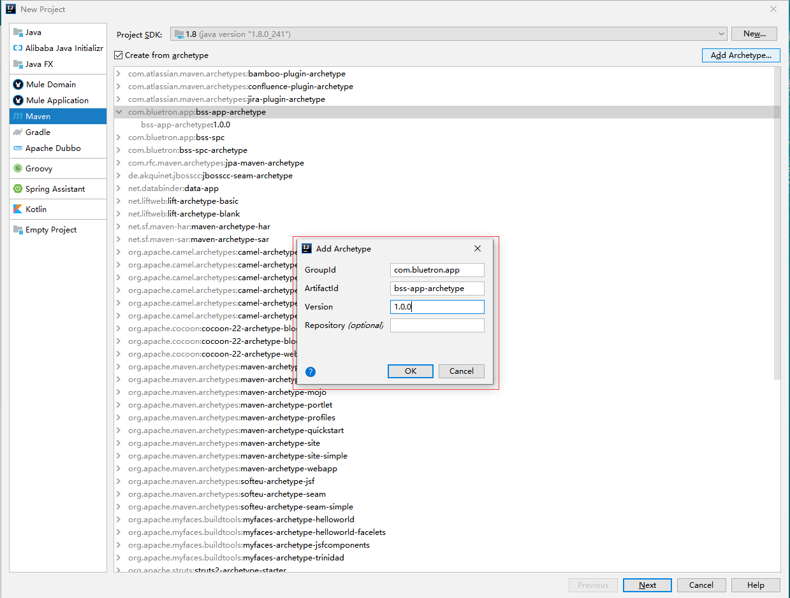
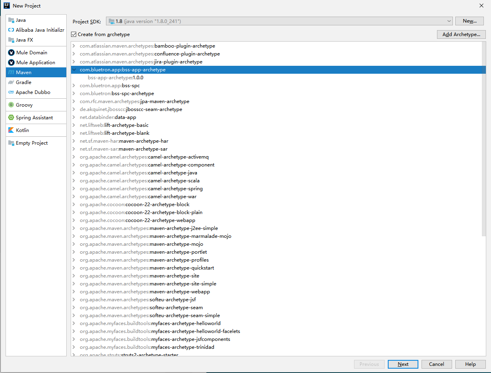
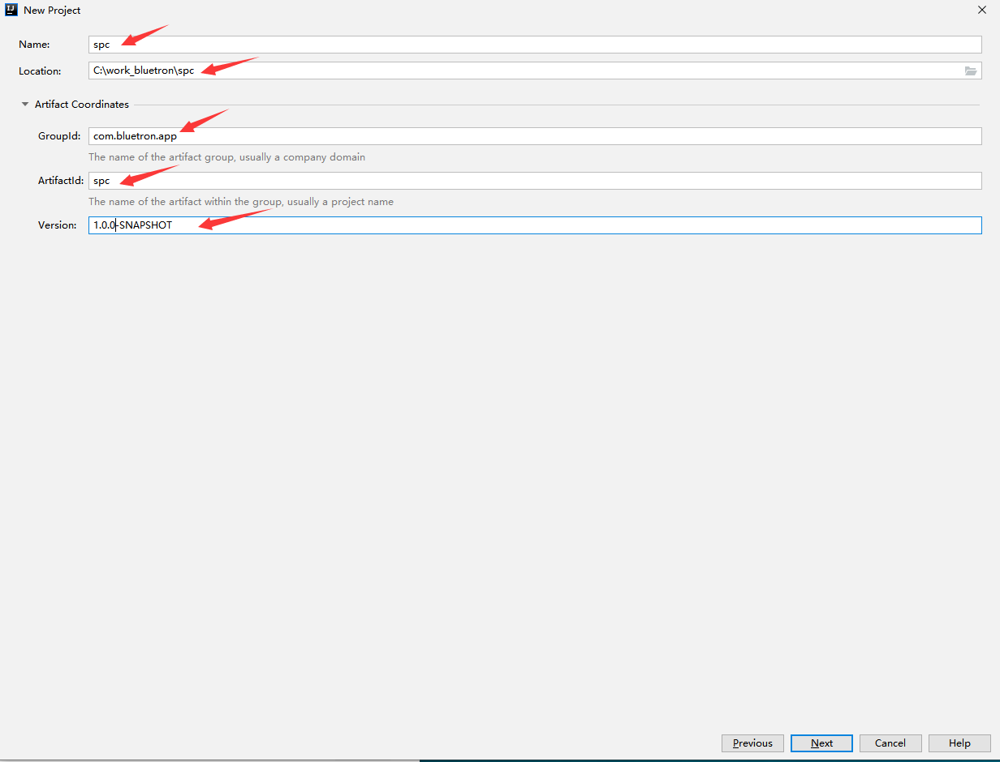
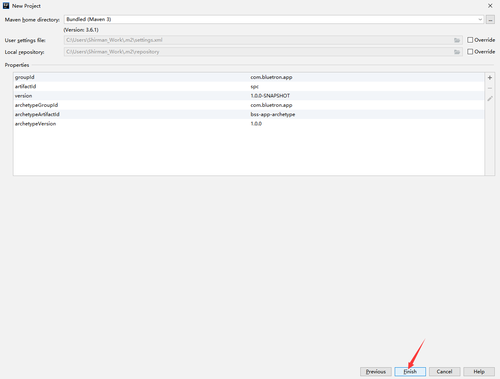

## springMVC-archetype
本工程为工业应用研发部maven archetype项目,皆在简化工程搭建，规范项目结构；

## 使用说明
效果演示

### IDEA 使用说明
#### 初次使用请配置本步骤
1. New Project -> Maven -> Add Archetype，如图


2. 填入archetype信息，如图
```pom
<dependency>
  <groupId>com.bluetron.app</groupId>
  <artifactId>SpringMVC-archetype</artifactId>
  <version>1.0.0-SNAPSHOT</version>
</dependency>
```


#### 创建项目
1. 选择com.bluetron.app:SpringMVC-archetype骨架


2. 填入工程信息，完成工程创建



## 版本
* 1.0.0 首发版本

## 联系作者
* chenqingfeng@supos.com


